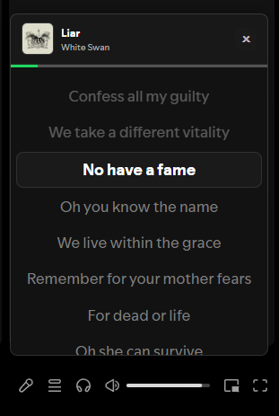
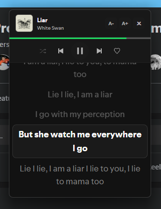
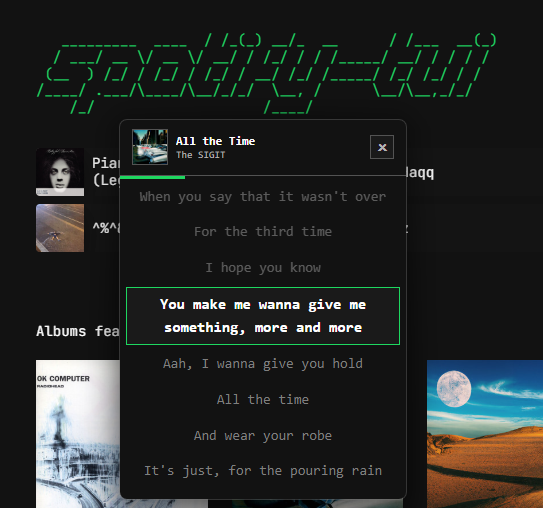

# LyricFloat

A minimal Spicetify extension that shows your Spotify lyrics in a floating window that stays on top of other apps.

<p align="center">
  
  
</p>
<p align="center">
  
</p>

*Disclaimer: If you read the code and wonder "why is it done this way?", the answer is most likely "because that is what worked."*

---

## Features

- **Floating PiP Window:** Draggable lyrics window that stays on top.
- **Theme Synchronization:** Auto-extracts colors, borders, and fonts from your active Spicetify theme.
- **Interactive Lyrics:** Click any line to seek to that moment in the song.
- **Media Controls:** Hover header for native playback controls and font resizing (A- / A+).
- **Progress Bar:** Real-time playback indicator beneath the header.

---

## Setup

1. Download the built extension file from [`dist/lyricfloat.js`](https://github.com/ahmadzip/lyricfloat/blob/main/dist/lyricfloat.js) (click the **Download raw file** button at the top right of the code block).
2. Copy the file into your Spicetify `Extensions` folder:
   - **Windows:** `%appdata%\\spicetify\\Extensions\\`
   - **Mac/Linux:** `~/.config/spicetify/Extensions/`
3. Add the extension to your Spicetify config:

```sh
spicetify config extensions lyricfloat.js
```

4. Apply the changes:

```sh
spicetify apply
```

---

## Development

Clone the repository:

```sh
git clone https://github.com/ahmadzip/lyricfloat.git
cd lyricfloat
```

Install dependencies:

```sh
npm install
```

Start the build watcher for active development:

```sh
npm run watch
```

And run this command to apply the changes:

```sh
spicetify apply
```

---

## Project Structure

```text
lyricfloat/
  src/
    app.ts             entrypoint, topbar button registration
    state.ts           shared state, config, and SVG icon helper
    theme.ts           theme extraction, CSS injection, and layout styles
    lyrics.ts          lyrics fetching, rendering, and sync engine
    pip.ts             PiP window creation, events, and drag mechanics
    spicetify.ts       wrappers for Spicetify internal APIs
    types/             TypeScript definitions
  dist/
    lyricfloat.js      compiled Spicetify extension
```

---

## Feedback

Built during break time. Suggestions, criticism, or pull requests are welcome.

---

## License

This project is licensed under the [MIT License](LICENSE).
